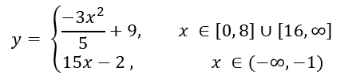
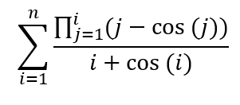
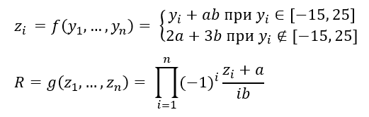
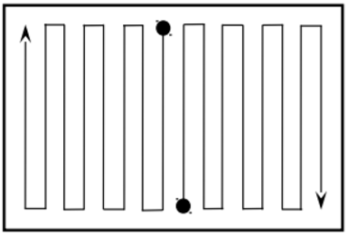

# Algorithms and Data structures Labs

<h3 align="center">Lab 1</h3> 
<b>Task:</b> 

A real number `x` is given. Determine the value of the given piecewise continuous function `y(x)`, if it exists, or display a message about the non-existence of the function for the given `x`.

<p align="center">
    
</p>

<details>
  <summary>Algorithm diagram (first method)</summary>
<p align="center">
    
</p>
</details>

<details>
  <summary>Algorithm diagram (second method)</summary>
<p align="center">
    
</p>
</details>


<h3 align="center">Lab 2</h3> 
<b>Task:</b> 

1. Given a natural number`n`. Calculate the value of a given formula.
2. To solve the problem write two programs:
	1) the first program must use nested loops to calculate the formula;
	2) the second program must perform the calculation of the formula using a single cycle using the method of dynamic programming.
3. Calculate the number of operations for each of the algorithms according to the method described in the lecture, adding to it the calculation of the number of calls to standard functions.
4. The program must correctly solve the problem for any given for which the result of the calculation can be correctly represented by type double.
5. Output the resulting data in a format with seven characters after the dot.

<p align="center">
    
</p>

<details>
  <summary>Algorithm diagram (nested loop method)</summary>
<p align="center">
    
</p>
</details>

<details>
  <summary>Algorithm diagram (dynamic programming method)</summary>
<p align="center">
    
</p>
</details>


<h3 align="center">Lab 3</h3> 
<b>Task:</b> 

1. Given real numbers `a`, `b`, integer `n` and one-dimensional array of real numbers `Y[n]`.
2. Obtain a one-dimensional array of real numbers `Z[n]`, the elements of which are `z_i = f(y1, y2,…, yn)`, where `f` is a given function, and `y_i` are the elements of the vector `Y[n]`.
3. Obtain the resulting value `R = g(z1, z2,…, zn)`, where g is a given function, and `z_i` are the elements of the vector `Z[n]`.
4. The values of the variables `a`, `b` and `n` are the initial data, which are chosen independently so that the function `f` exists for the given values of these variables.
5. The program must correctly solve the problem with the input data `a`, `b`, `n`.
6. The value of the initial array `Y[n]`, the intermediate array `Z[n]` and the resulting value `R` to display in a format with three characters after the dot.

<p align="center">
    
</p>


<h3 align="center">Lab 4</h3> 
<b>Task:</b> Implement drawing of a given algorithm in the console:

<p align="center">
    
</p>

<h3 align="center">Lab 5</h3> 
<b>Task:</b> 

The matrix of int numbers `A[m,n]` is given. Determine the presence among all elements of the matrix of any of the numbers in the range [0,5] and its location (coordinates) by the method of binary search, if the elements of each column are separately arranged in descending order.

The file `lab5_1.c` contains the code developed on requirements to the task. Here, a standard one-dimensional array binary search was applied to each row of our matrix. But this method is not very effective.

However, if we consider a binary search for a matrix and not for a one-dimensional array, then for this example the binary search should be performed in a different form, and not as suggested in the condition.

The following is an effective solution that works in `O(2ln(n+m))` time (provided that n>=2 and m>=2, we have: `log(n+m) < log(nm) = log(n) + log(m) < log(n+m) + log(n+m) = 2log(n+m)`, for a square matrix - `O(n)`).

Let `x` = the element we are trying to find in the matrix, `e` = the current element that we are processing in the array.

1) Let's start with the upper right element (provided that we have a sorted matrix).
2) Compare this element with `x`:
    * if `e = x`, then return the position e, because we found `x` in a given matrix.
	* if `e > x`, then move to the left to check the elements smaller than `e` (if you went beyond the matrix - go out of the loop).
	* if `e < x`, then move below to check the elements larger than `e` (if they went beyond the matrix - we leave the cycle).
3) Repeat three conditions above until we find the element or return a message that the desired element was not found.

The following is my variation on this problem:
1. Array elements are not sorted to sort them, make a nested loop.
2. In the nested loop, each element will be compared with all the elements below it.
3. If the element is larger than the element below it, they are interchangeable.
4. After executing the nested loop, we get an array in ordered elements in nondecreasing order.

<details>
  <summary>Program implementation</summary>

```c
#include <stdio.h>
#include <stdlib.h>
#include <math.h>
#include <time.h>

void main()
{
    int i, j, k, a, m, n, x;
    printf("Enter the dimension of the matrix (with a space): \n");
    scanf("%d %d", &m, &n);

    int Z[m][n];
    srand(time(NULL));
    
    printf("---------------------------\n");
    printf("Matrix before sorting: \n");
    for(i=0;i<m;++i) {
       for(j=0;j<n;++j) {
            Z[i][j]=20+rand()%10;
            printf("%d ", Z[i][j]);
       }
       printf("\n");
    }
    
    printf("---------------------------\n");
    printf("After sorting in nondecreasing order by rows: \n");
    for (i = 0; i < m; ++i) {
        for (j = 0; j < n; ++j) {
            for (k =(j + 1); k < n; ++k) {
                if (Z[i][j] > Z[i][k]) {
                    a = Z[i][j];
                    Z[i][j] = Z[i][k];
                    Z[i][k] = a;
                }
            }
        }
    }
    
    for (i = 0; i < m; ++i) {
        for (j = 0; j < n; ++j) {
            printf(" %d", Z[i][j]);
        }
        printf("\n");
    }
    
    printf("---------------------------\n");
    printf("After sorting in nondecreasing order by columns: \n");
    for (j = 0; j < n; ++j) {
        for (i = 0; i < m; ++i) {
            for (k = i + 1; k < m; ++k) {
                if (Z[i][j] > Z[k][j]) {  // Comparison of other elements of the array
                    a = Z[i][j]; // Use a temporary variable to store the last value
                    Z[i][j] = Z[k][j]; // change the places of the variable
                    Z[k][j] = a; // save the last value
                }
            }
        }
    }
    
    for (i = 0; i < m; ++i) {
        for (j = 0; j < n; ++j) {
            printf(" %d", Z[i][j]);
        }
        printf("\n");
    }
    
    printf("---------------------------\n");
    int my_val = 0;
    for (x = 20; x <= 25; ++x) {
        int l = 0, t = n-1;
        while ( l < n && t >= 0 ) { 
            if ( Z[l][t] == x ) {
              printf("Element %d found at position (%d, %d)\n", x, l, t);
              my_val ++;
            }
            if (Z[l][t] > x)
                t--;
            else
                l++;
        }
    }
    
    if (my_val == 0)
        printf("Items from the range [20, 25] were not found in the matrix ...\n");
}
```
</details>

<h3 align="center">Lab 6</h3> 
<b>Task:</b> The matrix of int numbers A[m,n] is given. Sort each row of the matrix by shaker sort in  nondecreasing order.

<details>
  <summary>Program implementation</summary>

```c
#include <stdio.h>
#include <stdlib.h>
#include <math.h>
#include <time.h>

void swap(int *a, int *b) {
    int temp;
    temp = *a;
    *a = *b;
    *b = temp;
}

void main() {
    int i, j, m, n;
    printf("Enter the dimension of the matrix (with a space): \n");
    scanf("%d %d", &m, &n);


    int Z[m][n];
    srand(time(NULL));
    printf("--------------------------\n");
    printf("Matrix before sorting:\n");
    for(i = 0; i < m; ++i){
       for(j = 0; j < n; ++j){
            Z[i][j] = 10 + rand()%90;
            printf("%d ", Z[i][j]);
       }
       printf("\n");
    }
    
    for(j = 0; j < m; ++j) {
        int left = 0,
        right = n - 1;
        
        while (left < right) {
            for (int i = left; i < right; i++) {
                if (Z[j][i] > Z[j][i + 1])
                    swap(&Z[j][i], &Z[j][i+1]);
                }
            right--;

            for (int i = right; i > left; i--) {
                if (Z[j][i - 1] > Z[j][i])
                    swap(&Z[j][i], &Z[j][i-1]);
                }
            left++;
        }
    }
    printf("--------------------------\n");
    printf("Matrix after shaker sorting:\n");
    for (i = 0; i < m; ++i) {
        for (j = 0; j < n; ++j) {
            printf(" %d", Z[i][j]);
        }
        printf("\n"); }
}
```
</details>